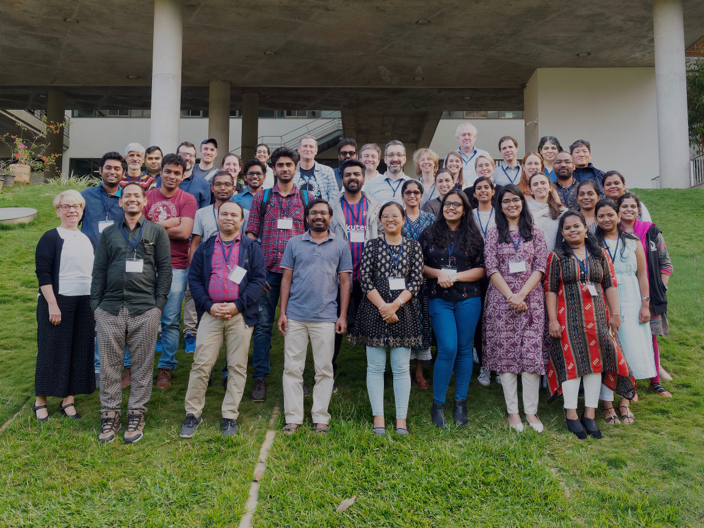

### EMBO Practical Course
## Computational analysis of protein-protein interactions in cell function and disease
#### 01 – 06 December 2019 | NCBS, Bengaluru, India

- EMBO-hosted [webpage for the course](http://meetings.embo.org/event/19-protein-protein)
- Twitter search results for [#EMBOprotein19](https://twitter.com/search?q=%23EMBOprotein19&src=typd&lang=en-gb)

## Collaborative document

https://yourpart.eu/p/emboppi19

--------------------------------
## Day 1

### Session I: PPI and diseases

| Time | Activity | Lead | Title |
| :---------- | :---------- | :---------- |:---------- | 
| 09:00 - 09:45	| Public Seminar | Natasha Wood | [The impact of protein dynamics on the spread of infectious viral diseases: Examples from the research in South Africa](training-materials/NatashaWood/2019.12.02_EMBO_NWood_talk_summary_.pdf) |
| 09:45 - 10:00	| Introduction to the Course and Speakers | Shachi & Malvika | - |
| 10:00 - 10:45 | Icebreaker & Tea break | - | - |
| 10:45 - 11:45	| Overview lecture | Tamás Korcsmáros | [Overview lecture: Computational analysis of protein-protein interactions in cell function and disease](https://github.com/malvikasharan/EMBO-PPI19-India-NCBS/blob/master/training-materials/EMBO-PPI_India-2019_TKorcsmaros_Overview-lecture_compressed.pdf) |
| 11:45 - 13:00	| Lecture | Marco Punta | [Resources for Protein families, protein domains and protein complexes](https://github.com/malvikasharan/EMBO-PPI19-India-NCBS/blob/master/training-materials/marco_punta/Bengaluru-EMBO-School-2019-Marco-Punta-lecture-compressed.pdf) |
| 13:00 - 14:00	| Lunch break | - | - |
| 14:00 - 15:30	| Practical | Marco Punta | [Practical - Profile-based sequence searches for protein structure and function annotation](https://github.com/malvikasharan/EMBO-PPI19-India-NCBS/blob/master/training-materials/marco_punta/Bengaluru-EMBO-School-2019-Marco-Punta-practical-compressed.pdf) |
| 15:30 - 16:30 | Lecture | Natasha Wood | [Web resources describing results of PPI experiments; design of such databases, minimal information to describe PPIs](training-materials/NatashaWood/2019_WebResources_for_describing_results_of_PPI_experiments.pdf) |
| 16:30 - 17:00	| Break | - | - |
| 17:00 - 18:30	| Lecture & Practical | Lars Juhl Jensen | Protein association networks with STRING: [Lecture](training-materials/LarsJuhlJensen/STRING_slides.pdf) & [Practical](https://jensenlab.org/training/string/)  ([stringApp teaser](training-materials/LarsJuhlJensen/20191202_stringAppDemo_v11.pdf)) |
| 19:30 onwards	| Dinner | - | - |

## Day 2

### Session II: Visualization of PPI networks

| Time | Activity | Lead | Title |
| :---------- | :---------- | :---------- |:---------- |
| 09:00 - 10:30 | Lecture & Practical | Nadezhda Doncheva | Gaining insights into networks using Cytoscape: [Lecture part I](training-materials/NadezhdaDoncheva/20191203_Cytoscape_3.7_Tutorial_partI.pdf) & [Tour of Cytoscape](https://cytoscape.org/cytoscape-tutorials/protocols/tour-of-cytoscape/)  Working with Cytoscape: [Lecture part II](training-materials/NadezhdaDoncheva/20191203_Cytoscape_3.7_Tutorial_partII.pdf) & [Practical](https://cytoscape.org/cytoscape-tutorials/protocols/basic-data-visualization/)|
| 10:30 - 11:00 | Break | - | - |
| 11:00 - 13:00 | Lecture & Practical | Nadezhda Doncheva & Lars Juhl Jensen | Retrieval, analysis and visualization of PPI networks using Cytoscape and stringApp: [Sources of networks lecture](training-materials/LarsJuhlJensen/Network_source_slides.pdf)  stringApp: [Lecture](training-materials/NadezhdaDoncheva/20191203_Tutorial_stringApp.pdf) & [Practical](https://jensenlab.org/training/stringapp/)|
| 13:00 - 14:00 | Lunch break | - | - |
| 14:00 - 15:30 | Practical | Toby Gibson | Revealing interactive features in protein multiple sequence alignments with Jalview: [Practical](training-materials/TobyGibson/), [Exercises](training-materials/TobyGibson/MSA_JalView_Exercise_Bangalore19.pdf)|
| 15:30 - 16:00 | Break | - | - |
| 16:00 - 17:15 | Lecture | Toby Gibson | Modular Protein Architecture and the Construction of Cell Regulatory Systems [Lecture](training-materials/TobyGibson/Gibson_EMBO-PPI_Bangalore_ModPA_19.pdf)|
| 17:15 - 18:00 | Lecture | R. Sowdhamini | Computational measures of strength of protein-protein interfaces and its relevance to disease biology |
| 18:00 - 18:10 | Break | - | - |
| 18:10 - 19:00 | Group activity | Malvika Sharan & Holger Dinkel | Unseminar: Using informal meetings for building local (bioinformatics) communities: [Slides](training-materials/HolgerDinkel/unseminar/unseminars.pdf) |
| 19:30 onwards | Dinner | - | - |

## Day 3

### Session IV: Intrinsically Disordered Regions (IDRs) - I

| Time | Activity | Lead | Title |
| :---------- | :---------- | :---------- |:---------- |
| 09:00 - 10:30 | Lecture & Practical | Zsuzsanna Dosztányi | Lecture & Practical - Biology and prediction of intrinsically unstructured peptide regions [Lecture](training-materials/ZsuzsannaDosztanyi/IDP_Talk.pdf) & [Practical](training-materials/ZsuzsannaDosztanyi/IDP_tut.pdf)|
| 10:30 - 11:00 | Break | - | - |
| 11:00 - 13:00 | Lecture & Practical | Holger Dinkel & Manjeet Kumar| Introduction of Linear motifs [Lecture 1](training-materials/HolgerDinkel/Short_Linear_Motifs.pdf), [Lecture 2](training-materials/HolgerDinkel/Short_Linear_Motif_Resources.pdf) & [Practical](training-materials/HolgerDinkel/ELM_tutorial_1.md) |
| 13:00 - 13:40 | Lunch break | - | - |
| 13:45 - 14:45 |  |  | Poster Session|
| 14:45 - 19:30 | Free | - | - |
| 19:30 onwards | Course Dinner | - | - |

## Day 4

### Session V: Protein structures and interaction interfaces

| Time | Activity | Lead | Title |
| :---------- | :---------- | :---------- |:---------- |
| 09:00 - 09:30| 	Lecture | 	Scooter Morris | [Protein structure databases and Chimera tool to explore structure](https://rbvi.github.io/chimera-tutorials/presentations/chimerax-embo-2019-bangalore.html)|
| 09:30 - 10:30| 	Practical & Demo | 	Scooter Morris | [Visualizing protein structures and interaction interfaces with UCSF ChimeraX](https://rbvi.github.io/chimera-tutorials/presentations/chimerax-embo-2019-bangalore.html)|
| 10:30 - 11:00| 			Break |
| 11:00 - 12:00| 	Practical | 	Scooter Morris | [Visualizing very large protein complexes with UCSF ChimeraX](https://rbvi.github.io/chimera-tutorials/presentations/chimerax-embo-2019-bangalore.html)|
| 12:00 - 13:00| 	Lecture | 	Tamás Korcsmáros | [PPIs in host-microbe interactions: how microbiome affect us and how pathogens tell us what to do](https://github.com/malvikasharan/EMBO-PPI19-India-NCBS/blob/master/training-materials/EMBO-PPI_India-2019_TKorcsmaros_Host-microbe-PPI-lecture.pdf) |
| 13:00 - 14:00| 			Lunch break |

### Session VI: Intrinsically Disordered Regions (IDRs) - II

| Time | Activity | Lead | Title |
| :---------- | :---------- | :---------- |:---------- |
| 14:00 - 15:00| 	Lecture & Practical | Manjeet Kumar, Holger Dinkel, Toby Gibson | [Linear motif biology and prediction, cooperativity in cellular signaling](https://raw.githubusercontent.com/malvikasharan/EMBO-PPI19-India-NCBS/master/training-materials/ManjeetKumar/Short_Linear_Motifs_in_Pathogens.pdf) (input files: [tir.fasta](https://raw.githubusercontent.com/malvikasharan/EMBO-PPI19-India-NCBS/master/training-materials/ManjeetKumar/tir.fasta), [caga.fasta](https://raw.githubusercontent.com/malvikasharan/EMBO-PPI19-India-NCBS/master/training-materials/ManjeetKumar/caga.fasta)|
| 15:00 - 16:30| 	Lecture & Practical | 	Miguel Andrade | [Structure and interactions of repeated and low complexity IDRs in proteins](https://raw.githubusercontent.com/malvikasharan/EMBO-PPI19-India-NCBS/master/training-materials/MiguelAndrade/lesson_repeats_1.pdf) (input files: [MR1_fasta.txt](https://raw.githubusercontent.com/malvikasharan/EMBO-PPI19-India-NCBS/master/training-materials/MiguelAndrade/MR1_fasta.txt))|
| 16:30 - 17:30| 			Longer break before the public seminars |
| 17:30 - 18:15| 	Public lecture | 	Norman Davey | In silico discovery of IDRs in host-pathogen interactions: revealing Ebola's weak spot |
| 18:15 - 19:00| 	Public lecture | 	Haribabu Arthanari | Inhibiting fungal multidrug resistance by disrupting protein-protein Interaction |
| 19:30 onwards| 			Dinner |

