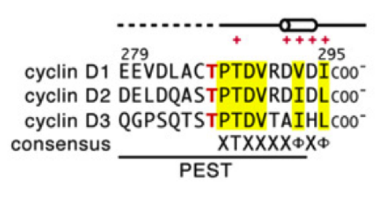

# [Resources]

ELM <http://elm.eu.org>

UniProt <http://www.uniprot.org/>

SlimSearch <http://slim.ucd.ie/slimsearch/>

PeCan <https://pecan.stjude.cloud/proteinpaint/>

ProViz <http://proviz.ucd.ie>

# ELM exercises
-------------------------------

**Objective**: Get familiar with the [ELM](Eukaryotic Linear Motif) prediction tool.

## 1. Search in [ELM] by copy/pasting the following sequence and using the following parameters:

> **\> P12931**
>
> MGSNKSKPKDASQRRRSLEPAENVHGAGGGAFPASQTPSKPASADGHRGPSAAFAPAAAE
> PKLFGGFNSSDTVTSPQRAGPLAGGVTTFVALYDYESRTETDLSFKKGERLQIVNNTEGD
> WWLAHSLSTGQTGYIPSNYVAPSDSIQAEEWYFGKITRRESERLLLNAENPRGTFLVRES
> ETTKGAYCLSVSDFDNAKGLNVKHYKIRKLDSGGFYITSRTQFNSLQQLVAYYSKHADGL
> CHRLTTVCPTSKPQTQGLAKDAWEIPRESLRLEVKLGQGCFGEVWMGTWNGTTRVAIKTL
> KPGTMSPEAFLQEAQVMKKLRHEKLVQLYAVVSEEPIYIVTEYMSKGSLLDFLKGETGKY
> LRLPQLVDMAAQIASGMAYVERMNYVHRDLRAANILVGENLVCKVADFGLARLIEDNEYT
> ARQGAKFPIKWTAPEAALYGRFTIKSDVWSFGILLTELTTKGRVPYPGMVNREVLDQVER
> GYRMPCPPECPESLHDLMCQCWRKEPEERPTFEYLQAFLEDYFTSTEPQYQPGENL

-   Cell Compartment: **Not specified**

-   Motif Probability Cutoff: **100**

-   Context information: **(leave blank)**

1.  Pay attention to many instances you find

2.  What can you say about the structure of the protein?

    a.  Do you find any domains?

    b.  Do you find any disordered regions?

## 2. Repeat the previous search (again accession P12931) using these parameters:

-   Cell Compartment: **cytosol**

-   Motif Probability Cutoff: **0.01**

-   Context information: **Homo sapiens**

1.  How many instances (roughly) do you find now?

2.  How many of the instances are \'annotated\'?

3.  Do the structural predictors/filters (SMART, GlobPlot, IUPRED,
    Secondary Structure) agree in terms of which regions are
    structured/disordered?

4.  Compare the location of the annotated instances with structural
    information at hand (IUPRED, Secondary Structure).

## 3. Submit the sequence of Paxillin (P49023) to ELM, using default parameters.

1.  Compare the results with a search for the same sequence when using
    the [cellular compartment] 'plasma membrane'

## 4. Search protein SRC\_MOUSE (P05480) for ELMs.

1.  Do you find "annotated instances"?

2.  If not, what's the closest to an 'annotated instance' that you can
    find? Investigate where this information might come from.

## 5. Submit the entry name \'P53\_HUMAN\'

1.  Do the cell compartments make sense?

2.  How many degrons are there in p53?

3.  Is there a CDK site in p53? Is there a Cyclin Box in p53?

## 6. (Optional) Search ELM using the protein name \'MDM4\_HUMAN\' and look for the \'USP binding motif\' DOC\_USP7\_MATH\_1.

1.  How many such motif instances are found in this protein sequence?

## 7. (Optional) Repeat this exercise with protein \'AMPH\_HUMAN\' and ELM class \'LIG\_Clathr\_ClatBox\_1\'

1.  Try to assess the biological relevance of each of these instances.

2.  Is the annotation for the biological relevance in accordance with
    the globular structure?

# PeCan exercise
--------------------------------

-   Go to elm.eu.org and enter ETV1\_HUMAN as search term; you should
    find a single annotated true positive instance of a degron.
    Where/What ELM class is it? Note down it\'s amino acid position.

Now go to PeCan and enter ETV1 as search term. Do you fidn any pediatric
mutations? How about Cosmic? Select only \"Fusion transcript\"
mutations; can you find any near the degron motif? Which tissue types
are these mutations found in? Are there differences in fusions and
frameshifts in tissue types?

-   Go to elm.eu.org and enter NOTC1\_HUMAN as search term. Find the
    annotated FBW7 degron (TP) and note down its position.

Now go to PeCan and enter notch1 as search term. Select only
\"Frameshift\" and \"nonsense\" mutations; if possible load COSMIC data
as well; analyse the area around the degron; additionally, by adding
\"missense\" is there another hotspot?

-   {width="4.245833333333334in"
    height="2.325in"}CCND2 possesses a degron in the C-Terminus, however
    the entry has not yet been annotated in elm.eu.org. Fortunately, a
    new structure came out recently: PMID
    [29279382](https://www.ncbi.nlm.nih.gov/pubmed/29279382); open CCND2
    in PeCan and look at the differences in pediatric & Cosmic data

(graphics from: \" [Structural basis of the phosphorylation-independentrecognition of
cyclin D1 by the SCF^FBXO31^ ubiquitin
ligase](https://www.ncbi.nlm.nih.gov/pmc/articles/PMC5777030/pdf/pnas.201708677.pdf)\"
*Li* PNAS 2018)

# ProViz exercise
---------------------------------

*ProViz aggregates and displays useful information from many resources
where relevant to linear motif discovery. *

Go to the **ProViz server**
[[http://proviz.ucd.ie]](http://proviz.ucd.ie)

Put p53 into the **Search for a Protein** field

Explore the results, then check out these operations and questions:

- Are there any methyllysine modifications?
- What is a cumulative switch?
- Are there any motifs in p53 than can antagonise MDM2 ubiquitination?
- Are there any splice variants in the DNA-binding domain? Do any motifs get removed in splice variants? Do you think p53 researchers study all the splice variants?
- What do the long structure modules correspond to?
- Can tetrameric p53 be exported from the nucleus?
- Click on the structure element of a short segment of p53. It goes to the PDB website (RCSB). Display the structure in the browser and adjust the viewing controls.
- What is the difference between mutagenesis sites and sequence variants?
- Which residue has the most sequence variants listed?
- Are there any sequence variants in the MDM2 degron (towards the N-terminus)?

